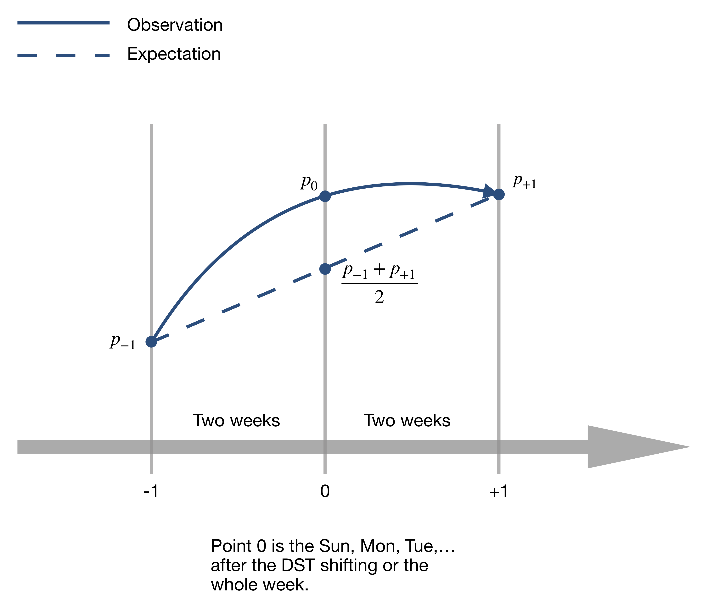
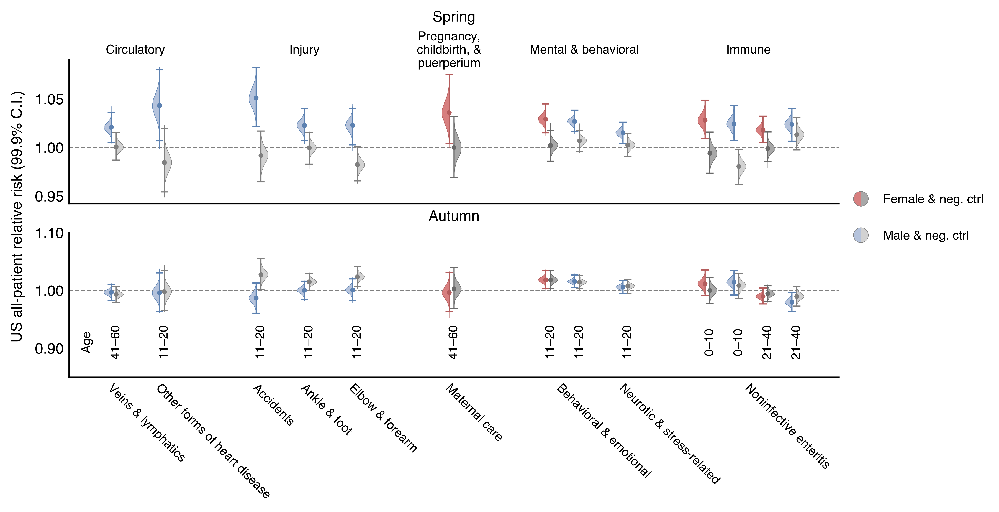

# Health Effects of Shifting to and from Daylight Saving Time (DST) in the US and Sweden

  

## This project features

* an agnostic, phenome-wide association study testing the whole spectrum of diseases in large-scale health databases,
* a simple and beautiful Bayesian framework for relative risk estimation,
* a paradigm for correcting the multiple comparisons problem in a Bayesian way,
* one of the very few real-world examples indicating the equivalence between the Bayesian hierarchical model and the Frequentist method with false coverage rate (FCR) adjustment, 
* findings of elevated risks distributed in various systems: circulatory and cardiovascular, injuries, pregnancy and childbirth, mental and behavioral, stress-related immune, etc.

  

  

## Contents

For US all patients (inpatients and outpatients) and US inpatients, we performed analyses on

* all states adopting DST,
* all states adopting DST on pseudo-DST dates as a negative control,
* all states without DST as another negative control,
* all northern, southern, eastern, and western DST states separately,
* first diagnoses of conditions of 0–10-y/o children who were completely recorded from birth in our data,
* first diagnoses on pseudo-DST dates as a negative control

using three approaches -- a Bayesian hierarchical model, a Frequentist approximation method, and a half-Bayesian approximation method.

For Swedish inpatients, we performed analyses on 

* medical records since 1980 when Sweden started observing DST,
* medical records before 1980 as a negative control

using two approaches -- a Bayesian hierarchical model and a Frequentist approximation method.

## Effective population sizes

The effective sizes of population strata, computed as sum of population sizes on the spring DST change dates from 2003 to 2014 (or 2015 for the inpatient data), are 

| Stratum       | US all-patient |  US inpatient  | 
|:--------------|:--------------:|:--------------:|
| F, 0–10       | 24,303,479     | 25,910,513     | 
| M, 0–10       | 25,421,528     | 27,103,968     | 
| F, 11–20      | 29,496,593     | 31,473,631     | 
| M, 11–20      | 30,677,787     | 32,741,080     | 
| F, 21–40      | 57,320,746     | 61,587,468     | 
| M, 21–40      | 52,366,989     | 56,436,933     | 
| F, 41–60      | 74,364,939     | 79,345,761     | 
| M, 41–60      | 66,205,024     | 70,589,479     | 
| F, 61–        | 33,281,829     | 35,507,396     | 
| M, 61–        | 28,399,046     | 30,241,444     | 

The average effective population size around the DST change dates every year is approximately 35 million. It means, on average, our database cover around 35 million people in the US around the DST dates every year. This represents about tenth of the whole country.

## Cost of daylight saving time

The elevation of relative risks translate to around

* 4000 more diagnoses of hypertensive diseases, 
* 1600 more attacks of other forms of heart disease, and 
* 700 more attacks of ischemic heart diseases in people over 60,
* 500 more neurotic, stress-related and somatoform disorders in people aged 41–60,
* 500 more behavioral and emotional disorders for 11–20 y/o,
* 200 more diagnoses of noninfective enteritis and colitis in 21–40 y/o.

in the first week of daylight saving time on average.

In total, about 45000 incidences of all kinds in the first week of DST could be linked to the time change. Considering the coverage rate of our data is about tenth around the DST change dates, 0.45 million incidences of diseases and conditions could emerge because of time change in the US. Globally, there could be 2 million more incidences of diseases in the post-spring-DST week associated with the time change. 

